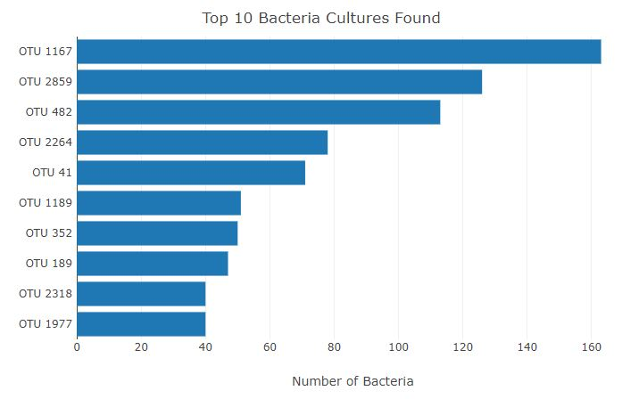
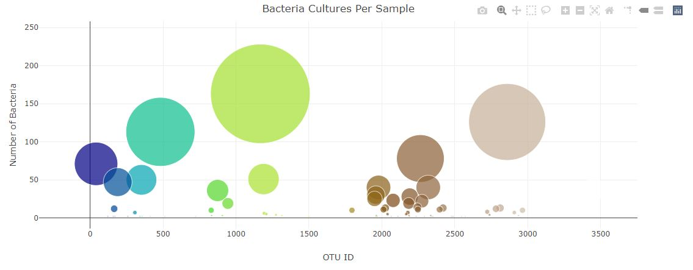
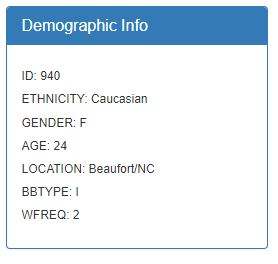
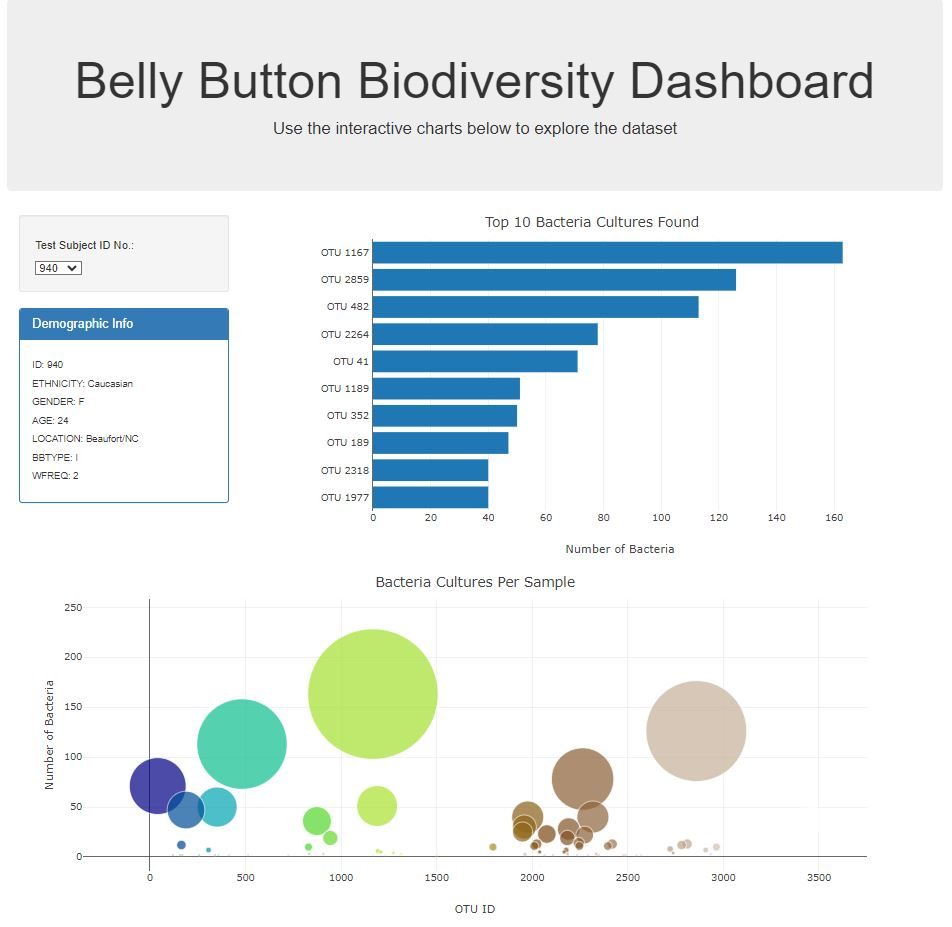

# belly-button-challenge

This is the repository for Monash University Data Analytics Bootcamp Module 14 Challenge

Import the dataset with `mongoimport --type json -d uk_food -c establishments --drop --jsonArray establishments.json.`in your terminal

Deployment Link to GitHub pages: https://lindsaymcculloch.github.io/belly-button-challenge/

## Contents

    * `index.html` file
    * `samples.json` file with bacteria data

* **static** folder
* **js** folder

    * `app.js` file

## Background

In this assignment, you will build an interactive dashboard to explore the Belly Button Biodiversity datasetLinks to an external site., which catalogues the microbes that colonise human navels.

The dataset reveals that a small handful of microbial species (also called operational taxonomic units, or OTUs, in the study) were present in more than 70% of people, while the rest were relatively rare.

## Instructions

Complete the following steps:

1. Use the D3 library to read in `samples.json` from the URL `https://static.bc-edx.com/data/dla-1-2/m14/lms/starter/samples.json`.

2. Create a horizontal bar chart with a dropdown menu to display the top 10 OTUs found in that individual.

    * Use `sample_values` as the values for the bar chart.

    * Use `otu_ids` as the labels for the bar chart.

    * Use `otu_labels` as the hovertext for the chart.

3. Create a bubble chart that displays each sample.

    * Use `otu_ids` for the x values.

    * Use `sample_values` for the y values.

    * Use `sample_values` for the marker size.

    * Use `otu_ids` for the marker colors.

    * Use `otu_labels` for the text values.

4. Display the sample's metadata, i.e., an individual's demographic information.
    
    * Loop through each key-value pair from the metadata JSON object and create a text string.

    * Append an html tag with that text to the `#sample-metadata` panel.

5. Update all the plots when a new sample is selected. Additionally, you are welcome to create any layout that you would like for your dashboard. An example dashboard is shown as follows:

6. Deploy your app to a free static page hosting service, such as GitHub Pages. Submit the links to your deployment and your GitHub repo. Ensure that your repository has regular commits and a thorough README.md file

## Resources

BCS Xpert Learning assistant

https://stackoverflow.com/questions/72543326/get-a-key-value-pair-from-a-string-json-simple-object

https://stackoverflow.com/questions/35783514/append-text-to-an-html-tag-using-javascript

https://stackoverflow.com/questions/67320685/how-to-create-a-drop-down-in-a-html-table-and-d3-bar-chart

Peer review of code for syntax errors/debugging of js code

## Acknowledgments

* Datasets provided by edX Boot Camps LLC.
* Hulcr, J. et al. (2012) A Jungle in There: Bacteria in Belly Buttons are Highly Diverse, but Predictable. Retrieved from: http://robdunnlab.com/projects/belly-button-biodiversity/results-and-data/Links to an external site.
